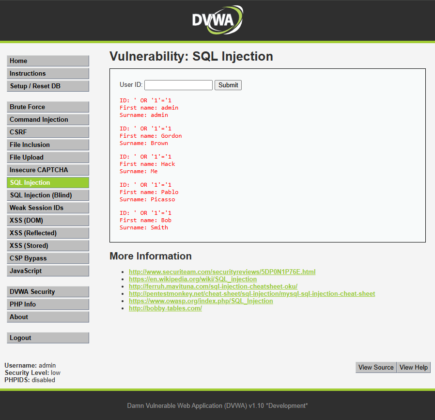

# Ataque 1: Inyección SQL (SQLi)

## 1. Evidencia del Ataque
A continuación se presenta la explotación de la vulnerabilidad en el formulario de búsqueda de usuarios. Se utilizó el payload `' OR '1'='1`.

## 2. Explicación Técnica
La vulnerabilidad de Inyección SQL ocurre porque la aplicación no sanitiza ni filtra correctamente los datos que ingresa el usuario antes de enviarlos a la base de datos. 

Al ingresar el payload `' OR '1'='1`, estamos alterando la lógica de la consulta SQL original en el backend. Las comillas simples cierran la cadena de texto esperada por el programador, y la condición `OR '1'='1'` añade una afirmación matemática que siempre es verdadera. Como resultado, la base de datos ignora cualquier restricción y devuelve todos los registros de la tabla.

**Impacto en TurBus Digital:** En el contexto de nuestro portal de clientes, esta vulnerabilidad permite a un atacante extraer la base de datos completa de pasajeros de TurBus, exponiendo información confidencial como nombres, apellidos, y potencialmente RUTs, correos y registros de viajes de los usuarios.

## 3. Severidad y Puntaje CVSS
Utilizando la calculadora oficial CVSS v3.1, este riesgo se clasifica de la siguiente manera:
* **Vector de Ataque:** Red (Cualquiera en internet puede acceder al portal).
* **Complejidad:** Baja (Existen herramientas automatizadas y es fácil de explotar).
* **Privilegios:** Ninguno (No se requiere estar logueado como cliente).
* **Confidencialidad e Integridad:** Altas (Compromiso total de la base de datos).

**Puntaje CVSS:** **9.8 (Crítico)**
*(Vector: CVSS:3.1/AV:N/AC:L/PR:N/UI:N/S:U/C:H/I:H/A:H)*

## 4. Políticas de Prevención y Controles de Mitigación

* **Política de Prevención:** Los desarrolladores del portal web de TurBus deben implementar **Consultas Parametrizadas** (Prepared Statements) en todo el código fuente. Esto asegura que la base de datos trate los ingresos del usuario estrictamente como datos de texto y nunca como código ejecutable.
* **Control de Mitigación:** Desplegar un **Web Application Firewall (WAF)** frente a los servidores de TurBus. El WAF actuará como un escudo que detectará y bloqueará automáticamente las peticiones web que contengan caracteres sospechosos o patrones conocidos de inyección SQL (como los comandos `UNION`, `OR 1=1`, etc.).