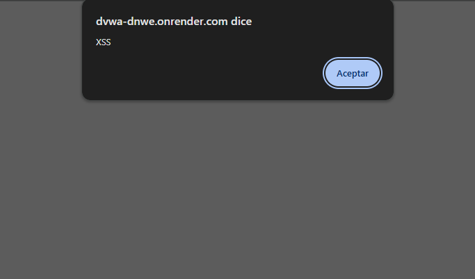

# Ataque 2: Cross-Site Scripting (XSS Reflejado)

## 1. Evidencia del Ataque
A continuación se expone la vulnerabilidad de XSS Reflejado, ejecutando el payload `` en el campo de entrada de la aplicación.

## 2. Explicación Técnica
[cite_start]El ataque Cross-Site Scripting (XSS) ocurre cuando una aplicación web toma información proporcionada por un usuario (en este caso, a través de la URL o un formulario) y la refleja directamente en la página web sin validarla ni codificarla adecuadamente[cite: 101].

[cite_start]Al ingresar ``, el navegador de la víctima interpreta este texto no como un dato, sino como código JavaScript legítimo de la página y lo ejecuta[cite: 54, 101].

**Impacto en TurBus Digital:** Un ciberdelincuente podría enviar a un cliente de TurBus un correo falso (phishing) con un enlace manipulado que diga "Sigue tu encomienda aquí" o "Descarga tu pasaje". Si el cliente hace clic, el código malicioso se ejecutará en su navegador. Esto permitiría al atacante robar las cookies de sesión del usuario, secuestrar su cuenta en el portal de TurBus y acceder a su historial de viajes, saldo, o realizar compras en su nombre.

## 3. Severidad y Puntaje CVSS
[cite_start]Utilizando la calculadora oficial CVSS v3.1[cite: 58], este riesgo se clasifica de la siguiente manera:
* **Vector de Ataque:** Red.
* **Complejidad:** Baja.
* **Privilegios:** Ninguno.
* **Interacción del Usuario:** Requerida (La víctima debe hacer clic en un enlace engañoso).
* **Alcance (Scope):** Cambiado (El ataque afecta al navegador del usuario, no solo a la infraestructura web).
* **Confidencialidad e Integridad:** Bajas.

**Puntaje CVSS:** **6.1 (Medio)**
[cite_start]*(Vector: CVSS:3.1/AV:N/AC:L/PR:N/UI:R/S:C/C:L/I:L/A:N)* [cite: 102]

## 4. Políticas de Prevención y Controles de Mitigación

* [cite_start]**Política de Prevención:** El equipo de desarrollo debe implementar una política estricta de **Codificación de Salida (Output Encoding)**[cite: 102]. [cite_start]Cualquier dato ingresado por el usuario debe ser convertido a entidades HTML antes de ser devuelto al navegador (por ejemplo, convertir el carácter `<` en `&lt;`), de modo que sea interpretado solo como texto y nunca como código ejecutable[cite: 148].
* [cite_start]**Control de Mitigación:** Configurar e implementar la cabecera HTTP **Content Security Policy (CSP)** en los servidores de TurBus[cite: 102]. CSP actúa como una lista blanca que restringe desde qué fuentes se pueden cargar y ejecutar scripts en el navegador del cliente, mitigando drásticamente el impacto de un ataque XSS en caso de que alguna entrada no haya sido filtrada.