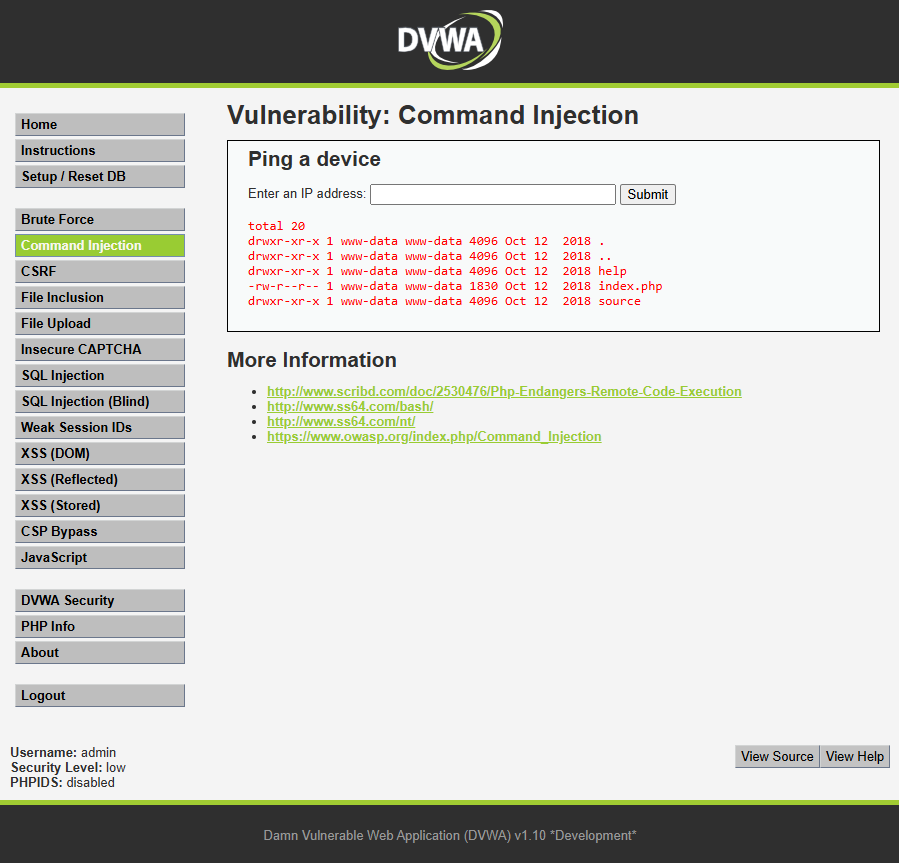

# Ataque 3: Inyección de Comandos (Command Injection)

## 1. Evidencia del Ataque
A continuación se demuestra la explotación de la vulnerabilidad de Inyección de Comandos en la funcionalidad de diagnóstico de red del portal. Se concatenó un comando del sistema operativo utilizando el payload `127.0.0.1; ls -la` (o `&& dir`).

## 2. Explicación Técnica
La inyección de comandos se produce cuando una aplicación web pasa datos proporcionados por el usuario directamente a la terminal o consola del sistema operativo (shell) sin la debida validación o limpieza. 

Al ingresar el payload, el servidor ejecuta primero el comando legítimo (el ping a 127.0.0.1) y, debido al separador de comandos (`;` o `&&`), ejecuta inmediatamente el comando malicioso que lista los archivos del directorio actual, devolviendo todo el resultado al usuario.

**Impacto en TurBus Digital:** Esta es una vulnerabilidad crítica. Un atacante no solo compromete la aplicación web, sino que toma el control del sistema operativo del servidor que aloja el portal de TurBus. Desde aquí, el atacante podría borrar los registros (logs), modificar los archivos del sitio web, robar credenciales del servidor, o utilizar esta máquina como "puente" para atacar la red interna de la empresa, paralizando por completo la venta de pasajes y el seguimiento logístico.

## 3. Severidad y Puntaje CVSS
Utilizando la calculadora oficial CVSS v3.1, este riesgo se clasifica de la siguiente manera:
* **Vector de Ataque:** Red.
* **Complejidad:** Baja.
* **Privilegios:** Ninguno.
* **Interacción del Usuario:** Ninguna.
* **Alcance (Scope):** Cambiado (El ataque salta de la aplicación web al sistema operativo subyacente).
* **Confidencialidad, Integridad y Disponibilidad:** Altas (Compromiso total del servidor).

**Puntaje CVSS:** **10.0 (Crítico)**
*(Vector: CVSS:3.1/AV:N/AC:L/PR:N/UI:N/S:C/C:H/I:H/A:H)*

## 4. Políticas de Prevención y Controles de Mitigación

* **Política de Prevención:** El equipo de desarrollo debe evitar a toda costa el uso de funciones que llamen directamente al sistema operativo (como `system()`, `exec()` o `shell_exec()`). Si se requiere una funcionalidad (como hacer un ping), se deben utilizar las APIs o librerías internas del lenguaje de programación. Si el uso de comandos externos es inevitable, se debe implementar una estricta "Lista Blanca" (Whitelist) que solo permita caracteres alfanuméricos muy específicos.
* **Control de Mitigación:** Aplicar el **Principio de Mínimo Privilegio**. El servicio o demonio web (Apache, Nginx, etc.) que ejecuta el portal de TurBus debe correr con un usuario del sistema operativo que tenga los permisos más restrictivos posibles, de modo que, si ocurre una inyección de comandos, el atacante no pueda modificar el sistema ni acceder a archivos sensibles.